# A template for workshop of [First Cloud Journey](https://cloudjourney.awsstudygroup.com/)

> [!NOTE]
> This template is based on the [original example workshop](https://van-hoang-kha.github.io/2-prerequiste/2.1-downloadhugotheme/), but:
>
> - Works with current version of Hugo (`v0.147.9` at 2025-07-01).
> - Has some improvements.

---

<details><summary>The state of the original example workshop</summary>

The [example workshop](https://van-hoang-kha.github.io/2-prerequiste/2.1-downloadhugotheme/) in [Guide for building a workshop](https://van-hoang-kha.github.io/) for First Cloud Journey is current broken because:

1. Somehow new version of Hugo (hugo `v0.144.2` on Linux) can't parse the `date` front-matter field.

   

2. `.Site.IsMultiLingual` (used in `hugo-theme-learn`) was deprecated in Hugo v0.124.0 and will be removed in Hugo 0.137.0 ([Source](https://github.com/gohugoio/hugo/pull/12887))

   

---

The solutions:

| Problem                                      | Solution                                                                                                                                                                                                                                                                                             |
| -------------------------------------------- | ---------------------------------------------------------------------------------------------------------------------------------------------------------------------------------------------------------------------------------------------------------------------------------------------------- |
| 1. `date` front-matter field can't be parsed | This is the first time I use Hugo, I've tried but didn't success to fix this. <br/> For the purpose of viewing this example workshop, I've removed all the `date` field as in [commit 2a39eb2](https://github.com/lethang7794/fcj-example-workshop/commit/2a39eb2f63957454c15295888c8213c785d1c7dc). |
| 2. `.Site.IsMultiLingual` is removed.        | I've replace all `.Site.IsMultiLingual` with `hugo.IsMultilingual` as in [commit 265dc2a](https://github.com/lethang7794/fcj-example-workshop/commit/265dc2a23533dbd2c368a3c4df844d249630f559).                                                                                                      |

</details>

## What's changed

- Support markdown syntax for Alert (you can still use Hugo's notice).

  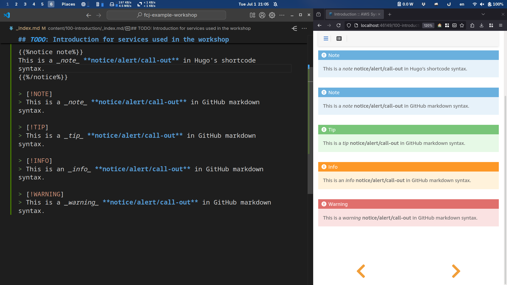

- Automated create Table of content for each section.

  Example 1:
  - 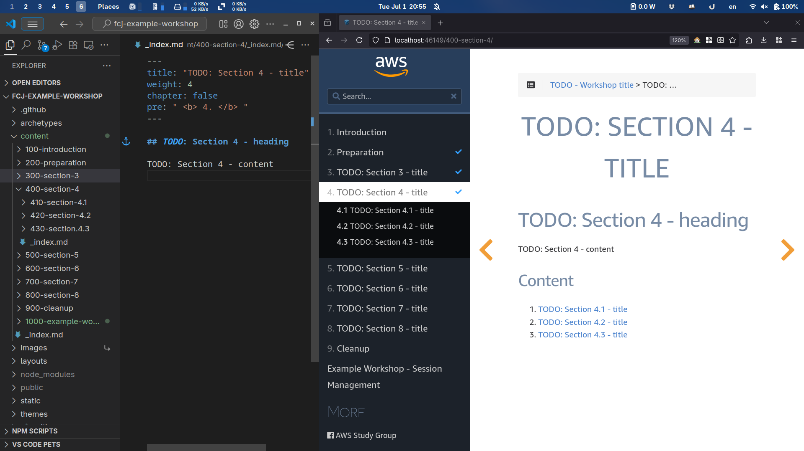

  Example 2:
  - 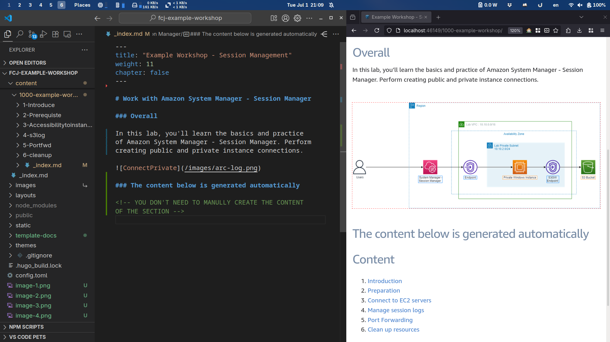

  Example 3:
  - 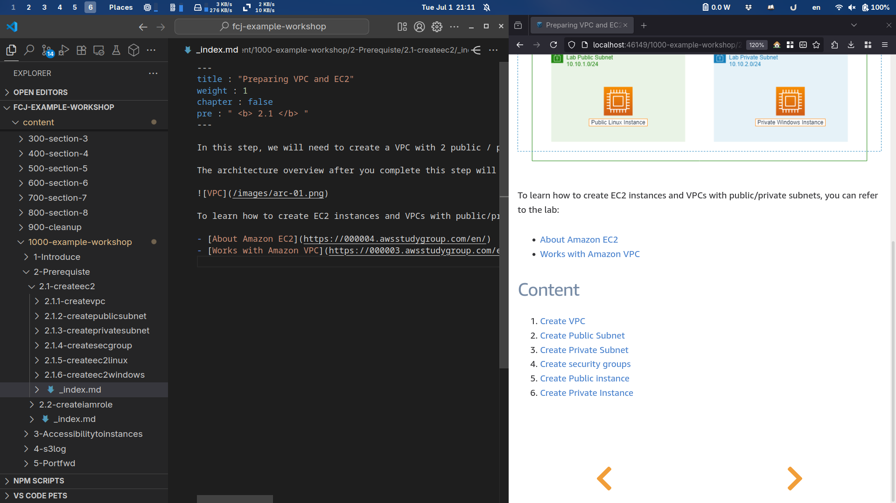

- Support shortcode for creating table of content for a page.

  ```
  {}
  ```

  Output:
  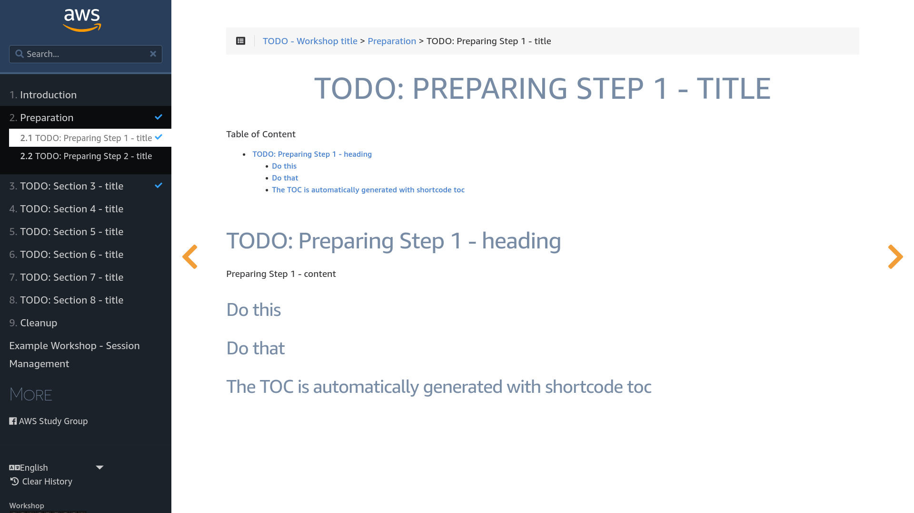

- Include a GitHub Action workflow to publish the workshop as GitHub Pages.

  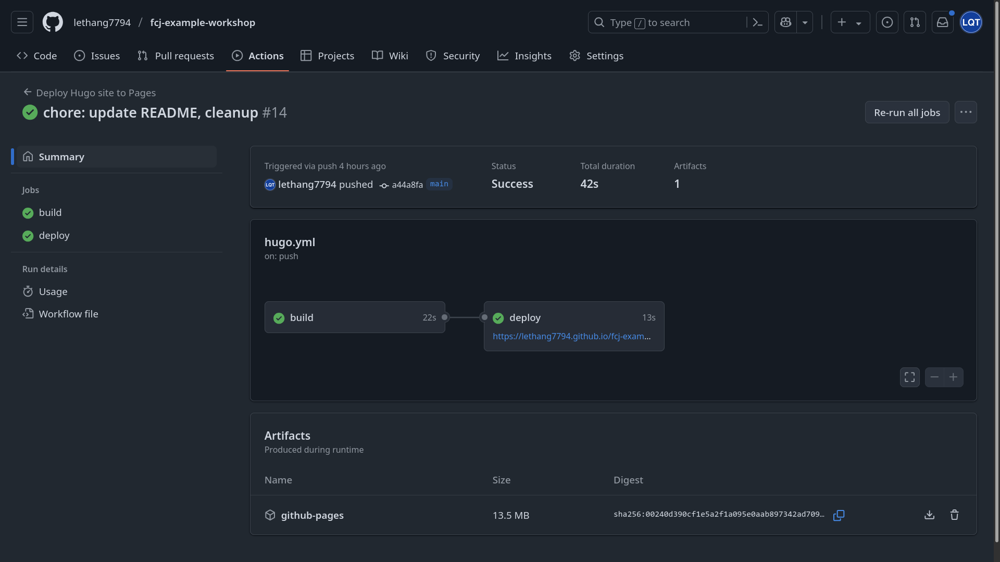

</details>

## How to get started?

1. Use this workshop as a template for your GitHub repository [by click here](https://github.com/new?template_name=fcj-example-workshop&template_owner=lethang7794).
2. Go to your GitHub repository / `Settings` / `Pages` section / `Build and deployment`.

   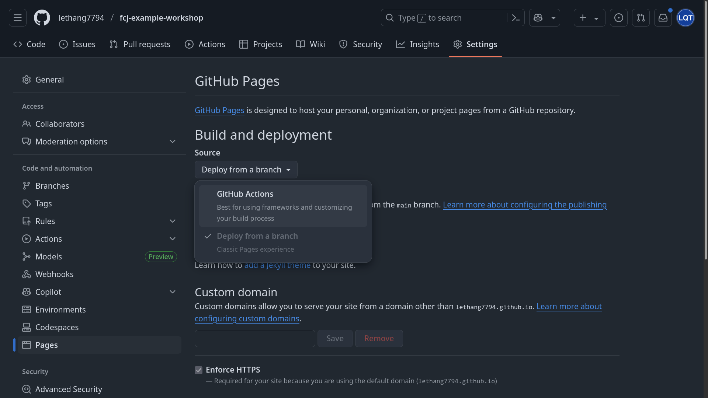

   Change `Source` from `Deploy from a branch` to `GitHub Actions`.

   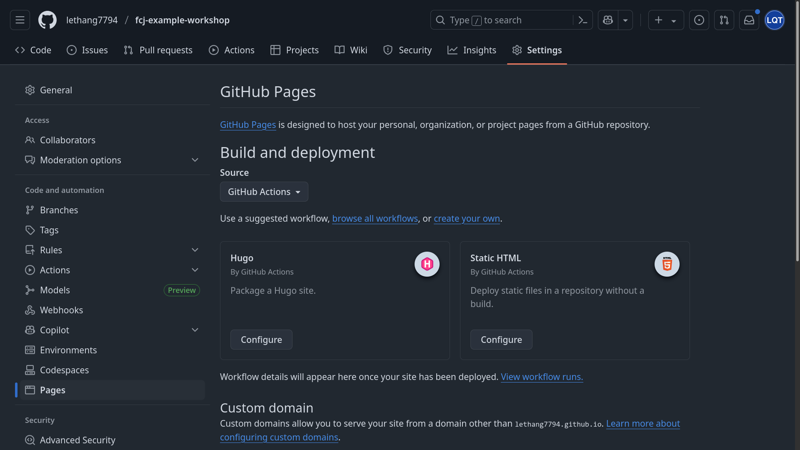

3. Clone your GitHub repository to your local machine (or from your GitHub repository, press `.` on your keyboard)
4. Make some changes

   ```bash
   echo "# My awesome FCJ workshop" > README.md
   ```

5. Commit and push to your GitHub repository.

   ```bash
   git add README.md
   git commit -m "update README"
   git push origin main
   ```

6. Visit your workshop that's deployed as a GitHub Pages.

> [!NOTE]
> To access your workshop as the GitHub Pages
>
> - Open your GitHub repository page, e.g. <a href="https://github.com/<YOUR_USERNAME>/<YOUR_REPO>">https://github.com/<YOUR_USERNAME>/<YOUR_REPO></a>
> - Scroll to the bottom, in the `Deployments` on the right side, click on `github-pages (... ago)`
>
>   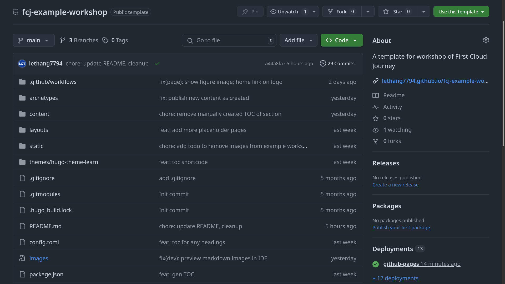
>
> - You will see the URL for your repository's GitHub Pages.
>
>   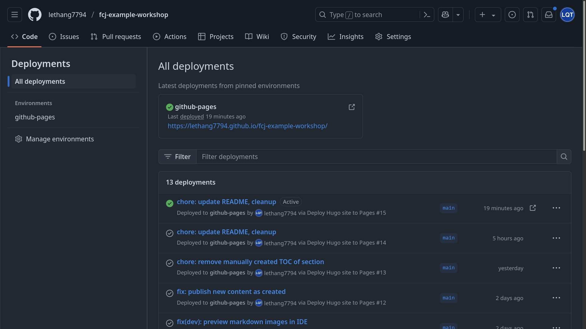

## Tips and tricks

<details><summary>How to preview images while editing markdown using an IDE?</summary>

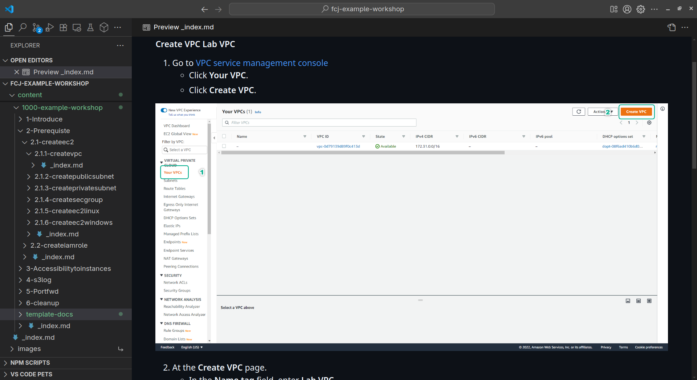

Create a symbolic link to the `static/images/` in the root of this repo.

```bash
# In root of your repository
[ -d images ] && { [ -d images-backup ] && echo "images-backup already exists." && exit 1 || mv images images-backup && echo "Moved images to images-backup."; } || exit 0
ln -s $PWD/static/images/ $PWD
```

</details>
